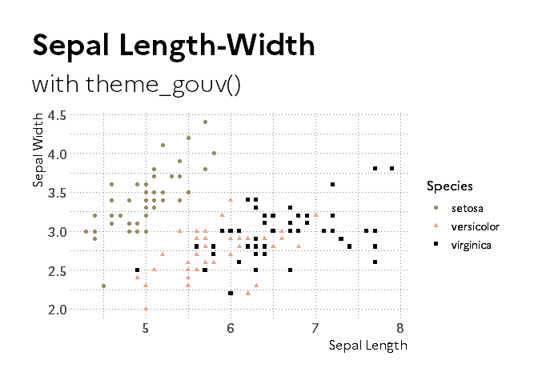

<!-- README.md is generated from README.Rmd. Please edit that file -->

# gouvdown

<!-- badges: start -->

[](https://github.com/spyrales/gouvdown/actions)
[](https://codecov.io/gh/spyrales/gouvdown?branch=master)
[](https://github.com/spyrales/gouvdown/actions)
<!-- badges: end -->

**gouvdown** let you write R Markdown documents which comply with the
French government design system.

## Installation

You can install the development version from
[GitHub](https://github.com/) with:

``` r
# install.packages("remotes")
remotes::install_github("spyrales/gouvdown")
```

## Palettes

**gouvdown** provides the official colors and a set of palettes.


## Theme

**gouvdown** provides themes for `{ggplot2}` graphics and maps.



## Rmarkdown

### html_document

**gouvdown** provides a html template for `{Rmarkdown}`


### bookdown

**gouvdown** provides a bookdown project template for `{bookdown}`


### pagedown

**gouvdown** provides a bookdown project template for `{pagedown}`

**CAPTURE ECRAN A AJOUTER UNE FOIS FINALISE**

This template is generated through a Github Action for Linux, Windows
and MacOS and uploaded as an artifact. This aims at helping to follow
the development of `{pagedown}` by providing a visual check.

### Word output format

**gouvdown** provides a word template for `{Rmarkdown}` for writing an
official letter.

## References

-   Design system:
    <https://www.gouvernement.fr/charte/charte-graphique-les-fondamentaux/introduction>
-   Example:
    <https://github.com/DISIC/design.numerique.gouv.fr/tree/master/src/assets>
