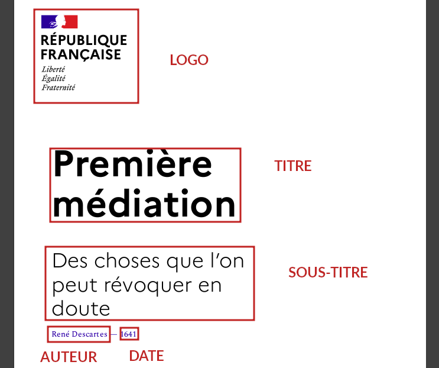

```{r, include = FALSE}
knitr::opts_chunk$set(
  collapse = TRUE,
  comment = "#>",
  warning = FALSE,
  message = FALSE,
  echo = FALSE
)
```

De nombreuses publications statistiques demandent une mise en page fine et sur-mesure pour être publiées. C'est notamment le cas dans la plupart des organisations publiques qui publient et diffusent des chiffres et des analyses sous des formats courts (de 2 à 12 pages en général). 

La fonction `propre_brochure` du package `gouvdown` et ses ressources associées vise à répondre à ces besoins de mise en page tout en permettant de s'inscrire dans le cadre de publications reproductibles grâce à l'utilisation de R et de RMarkdown.

Pour davantage d'informations sur la reproductibilité des publications et son intérêt, vous pouvez vous tourner vers la documentation de la démarche PROPRE, mise en place par ThinkR et le réseau des DREAL :

- au format [long](https://rdes_dreal.gitlab.io/propre/index.html) ;
- au format [court](https://github.com/spyrales/propre.brochure) (cette brochure est-elle même réalisée grâce à la fonction `propre_brochure` présentée ici).

## Principes généraux

> La création de ces documents s'inscrit dans le cadre du travail sur la marque-État et est donc plus spécifiquement adaptée aux institutions qui l'utilisent.

La création de documents repose sur l'utilisation de [RMarkdown](https://rmarkdown.rstudio.com/) qui permet de générer des documents HTML en y incluant du code R et des options de formattage grâce à des [balises](https://abcdr.thinkr.fr/redaction-markdown/).

De bonnes ressources pour se former à RMarkdown existent, notamment :

- [Diffuser et publier avec `rmarkdown`](https://juba.github.io/tidyverse/13-rmarkdown.html)
- [R Markdown: The Definitive Guide](https://bookdown.org/yihui/rmarkdown/)
- [R Markdown Cookbook](https://bookdown.org/yihui/rmarkdown-cookbook/)

## Éléments importants

> Les utilisateurs plus avancés pourront passer cette partie.

Trois éléments principaux sont nécessaires pour bien comprendre l'utilisation de `propre_brochure`.

### En-tête YAML

Un document RMarkdown se divise en deux parties principales, l'en-tête YAML (nom d'un format de fichier) et le texte. Cette en-tête va servir à paramétrer notre fichier et son aspect en sortie en lui donnant des instructions générales.

Elle se présente comme une suite d'instructions encadrées par deux `---`. Par exemple :

```{yaml}
---
title: "Première médiation"
subtitle: "Des choses que l'on peut révoquer en doute"
author: "René Descartes"
date: 1641
lang: fr
paged-footnotes: true
output: 
  gouvdown::propre_brochure:
    logo: "rf"
    width_main_column: 12
knit: pagedown::chrome_print
---
```

Il faut retenir que l'indentation est très importante car elle indique de quel élément va dépendre chaque ligne. Lorsque le fichier bloque dès le début de la compilation, c'est l'une des premières erreurs à rechercher.

On peut comprendre cet élément comme une liste de variables où il faut indiquer des valeurs :

- le titre (`title`), le sous-titre (`subtitle`), la date (`date`), l'auteur (`author`) ;
- le format de sortie (`output`) et des arguments qui le précisent (`logo`, `width_main_column`). C'est ce qui permet d'utiliser la fonction `propre_brochure` ;
- des arguments complémentaires (`knit`), qui sert ici à générer un fichier PDF directement grâce à Chrome en imprimant le contenu du fichier HTML.

### Balisage

RMarkdown repose sur Markdown qui, contrairement à d'autres outils comme Word ou LibreOffice, n'affiche pas directement la mise en forme du document. Il faut une étape de compilation (en appuyant sur le boutant _Knit_ ou en utilisant la fonction `rmarkdown::render`) pour cela.

Cela implique que la mise en forme est directement incluse dans le texte au moyen de balises qui permettent d'indiquer le niveau du titre, si il s'agit d'un bloc de citation, d'un texte en gras, ou en italique.

- `**texte en gras**`
- `_texte en italique_`
- `# Titre de niveau 1`
- `## Titre de niveau 2`
- `### Titre de niveau 3`
- `> citation`

Vous pourrez aussi rencontrer des blocs de code dans le texte ou séparé. Ils permettent d'intégrer du code R (ou d'un autre langage) directement dans le document.

### Div

Ces balises pré-formatées couvrent quelques cas bien précis. Il arrive toutefois que l'on souhaite personnaliser davantage les éléments en leur donnant une taille, une position ou autre.

Pour cela on utilise des _div_ que l'on peut assimiler à des blocs auxquels il est possible de donner des instructions plus détaillées par l'utilisation de CSS. Comme un _div_ est un bloc, il faut l'ouvrir mais aussi le fermer.

On peut déclarer les _div_ de deux façons :

Soit en utilisant la syntaxe HTML (à privilégier quand on est en présence de tableaux) :

```
<div>

</div>
```

Soit le raccourci (avec autant de `:` que l'on souhaite à partir de 3 et tant que l'ouverture et la fermeture en comportent autant) :


```
:::

:::
```

Pour styler ces éléments, il faut donner à chaque _div_ une classe qui porte un nom, afin que le programme puisse le retrouver. Exemple :

```
<div class="ma-classe">

</div>
```

ou

```
:::{.ma-classe}

:::
```

Un certain nombre de classes ont été définies par défaut dans `propre_brochure` et pourront donc être utilisées pour la mise en forme des éléments.

## Utiliser `propre_brochure` et ses arguments

L'utilisation du format `propre_brochure` se fait au sein de l'argument `output` dans le YAML.

Deux arguments principaux sont proposés :

- `logo` : bloque-marque à afficher. La liste des bloques-marques disponibles est présente [ici](https://github.com/spyrales/gouvdown/tree/master/inst/resources/blocs_marque). Si le votre n'y est pas, n'hésitez pas à en proposer l'ajout. Par exemple les valeurs de logo suivantes donnent :

```{r table_logo}
df_logo <-
  data.frame(
    logo = c("rf",
             "ministere_te_tc_mer"),
    img = paste0("
      ,
      system.file(
        "resources/blocs_marque/ministere_te_tc_mer",
        "MIN_TE+CT+Mer_RVB.png",
        package = "gouvdown"
      )
    )
    , "){height=5%}")
  )

knitr::kable(df_logo, "html", col.names = c("Logo", "Bloc-marque"))
```

- `width_main_column` : largeur (en cm) de la colonne de texte principale (de la classe `main-column`).

```{r table_width}
df_width <-
  data.frame(
    logo = c("width_main_column: 60",
             "width_main_column: 80"),
    img = paste0("
    , "){height=20%}")
  )

knitr::kable(df_width, "html", col.names = c("Largeur", "Résultat"))
```

Il est aussi possible d'utiliser les arguments proposés par la fonction `pagedown::html_paged` comme pour inclure en supplément un autre fichier `css`.

## Le style

Les éléments de titre sont assignés à certaines places.

```{r, out.width = '500px', out.height = '400px'}

```

Les styles présents suivent le design proposés par dans le cadre de la marque-État (polices notamment).

Quelques exemples :

```{r table_style}
df_styles <-
  data.frame(
    style = c(
      "## Titre 2",
      "### Titre 3",
      "**texte en gras**",
      "_italique_",
      "texte normal",
      "> citation"
    ),
    img = paste0(
      ",
      "){height=100%}"
    )
  )

knitr::kable(df_styles, "html", col.names = c("Style", "Résultat"))
```

On peut aussi inclure directement des graphiques ou des tableaux (FORMAT DES TABLEAUX TO DO) qui pourront être directement dans la bonne charte.

Par exemple :

```{r graph_gouvdown, fig.width=8, fig.height=4, echo = TRUE}
library(gouvdown)
library(ggplot2)

ggplot(data = mtcars, 
       aes(x = mpg, y = disp, color = as.character(cyl))) +
  geom_point(size = 2) +
  scale_color_gouv_discrete(name = "", palette = "pal_gouv_qual2") +
  labs(title = "Puissance des voitures par cylindres",
       caption = "Source : mtcars") +
  theme_gouv()
```

Pour plus de détails sur ce point, on pourra utilement se reporter à la [vignette correspondante](../graph_gouv.html).

## Mise en page

Une gestion fine de la mise en page s'effectue au moyen des classes CSS à disposer dans le document.

### Colonnes

Deux classes principales permettent de diviser le texte en deux colonnes. Il convient alors de réaliser la mise en page page par page en découpant et en répartissant le texte dans les colonnes souhaitées.

La colonne principale se fixe au moyen de la classe `main-column`. Sa largeur peut se régler au moyen du paramètre `width_main_column` de la fonction `propre_brochure`. On lui donne alors une largeur en pourcentage de la page. Elle se situe alternativement à droite ou à gauche en fonction de si la page est paire ou impaire.

```{r, out.width = '400px'}

```

La colonne secondaire se fixe par `secondary-column`. 

```{r, out.width = '400px'}

```

De façon plus fine, on peut utiliser `secondary-column-top` pour placer un élément en haut de cette colonne secondaire ou `secondary-column-bottom` pour un placement en bas.

### Classes de positionnement

D'autres classes spécifiques permettent de gérer des blocs spécifiques :

+ `header` positionne un bloc en haut à gauche 

+ `numbers` créé un encart en bas à droite

```{r, out.width = '400px'}

```

+ `footer` créé une note de bas de page

```{r, out.width = '400px'}

```

+ `front-page` et `last-page` définissent les premières et dernières pages.

## Affiner

Le squelette du template constitue une première proposition de mise en page.

Pour un exemple plus complet, on pourra se reporter à [la brochure de la démarche PROPRE](https://github.com/spyrales/propre.brochure). Les commentaires présents dans le fichier permettent de bien comprendre l'effet de chaque élément sur la mise en page.

## Pour aller plus loin

Si l'on souhaite aller encore plus loin, quelques possibilités s'ouvrent.

### Inspecter le fichier HTML

Avant la production du fichier PDF se trouve un fichier HTML, dans le même répertoire. Il est conseillé de s'y reporter pour tester et débugger lorsque cela est nécessaire.

Pour cela on l'ouvre avec Chrome ou Chromium et on utilise l'option _Inspecter_ (faire clic-droit sur un élément).
L'apparence du fichier a été spécialement pensée pour faciliter l'analyse et la conception de la mise en page (ajout de repères visuels).

Le détail du fichier sous forme HTML apparaît alors. En cliquant sur un élément on peut retrouver ses propriétés CSS. Il est aussi possible de tester des changements de valeurs ou de propriété et d'y voir les effets.

```{r, out.width = '600px', out.height = '350px'}

```

> La façon dont est produit le PDF fait qu'un programme (en JavaScript) vient modifier _a posteriori_ le CSS (notamment pour créeer la pagination). Certaines modifications que vous ferrez peuvent en être affectées.

### Ajouter des fichiers CSS

Il est possible de créer des classes personnalisées dans le fichier. On peut alors leur donner des valeurs et les utiliser pour pousser davantage la personnalisation.

Cela demande notamment de connaître le CSS. Une excellente ressource sur le sujet est proposée par [Mozilla](https://developer.mozilla.org/fr/docs/Web/CSS).

Il faut alors créer un fichier en .css et l'appeler dans l'instruction `css` de notre fonction, dans le YAML.

```{yaml}
---
title: "Un titre"
output: 
  gouvdown::propre_brochure:
    css: "dossier1/dossier2/mon_fichier.css"
knit: pagedown::chrome_print
---
```

> A noter que vous pouvez recouvrir les propriétés des classes existantes en incluant un nouveau fichier avec la même propriété et une valeur différente pour une classe donnée.

### `pagedown` et paged.js

Pour mieux comprendre l'ensemble du template, il peut être souhaitable de revenir à la source.

`propre_brochure` repose sur d'autres outils :

- `paged.js` qui permet de découper les instructions en pages - [documentation](https://www.pagedjs.org/documentation/) ;
- `pagedown` qui implémente le précédent dans RMarkdown - [documentation](https://pagedown.rbind.io/).

La documentation de ces deux outils est très complète et l'on conseille de s'y reporter pour des utilisations avancées.


